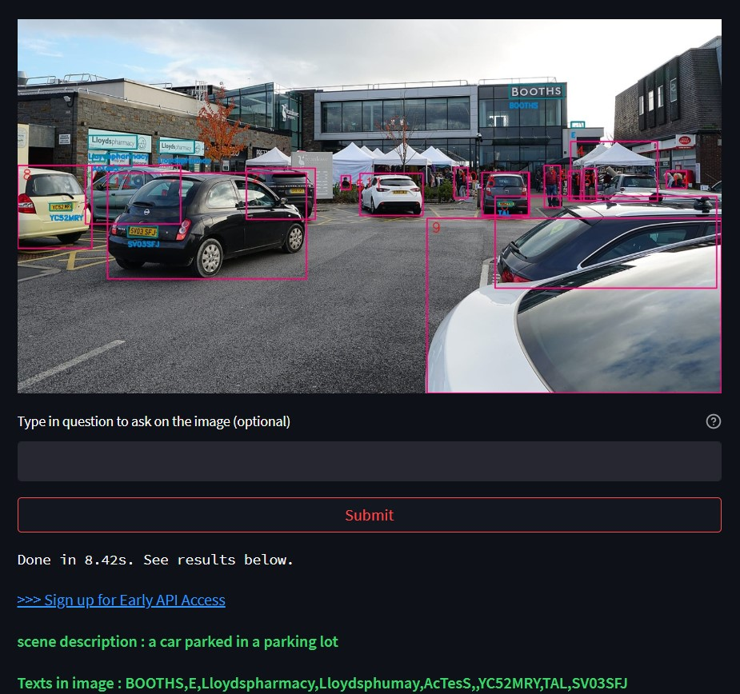
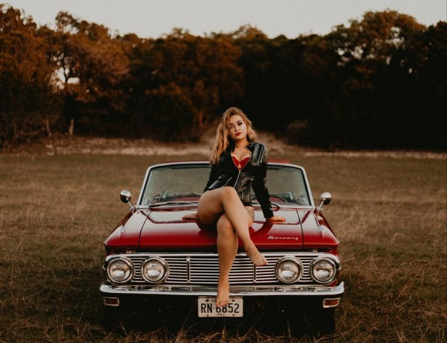
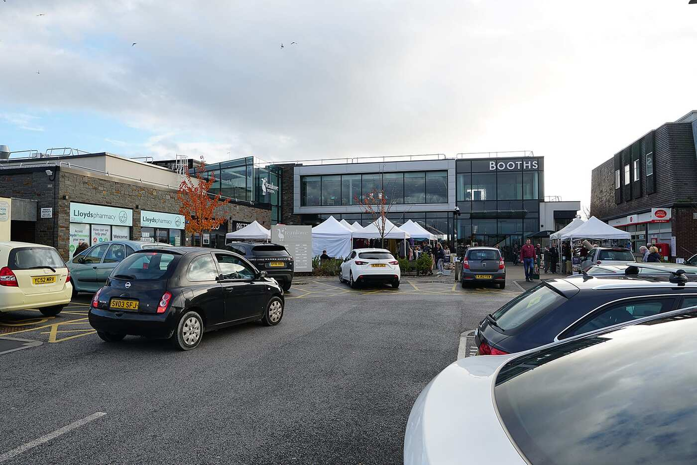
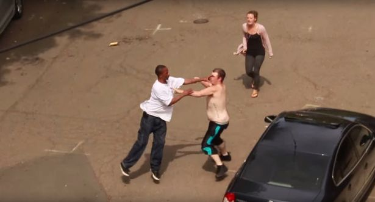
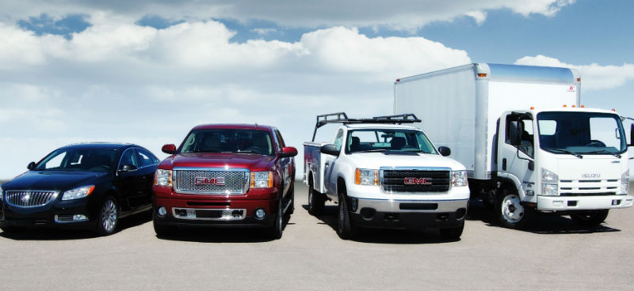
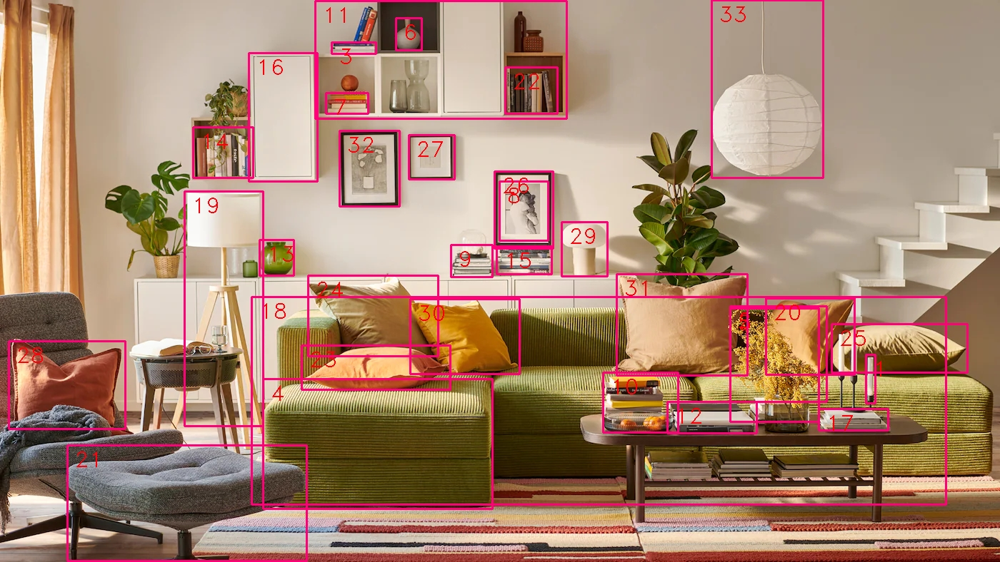
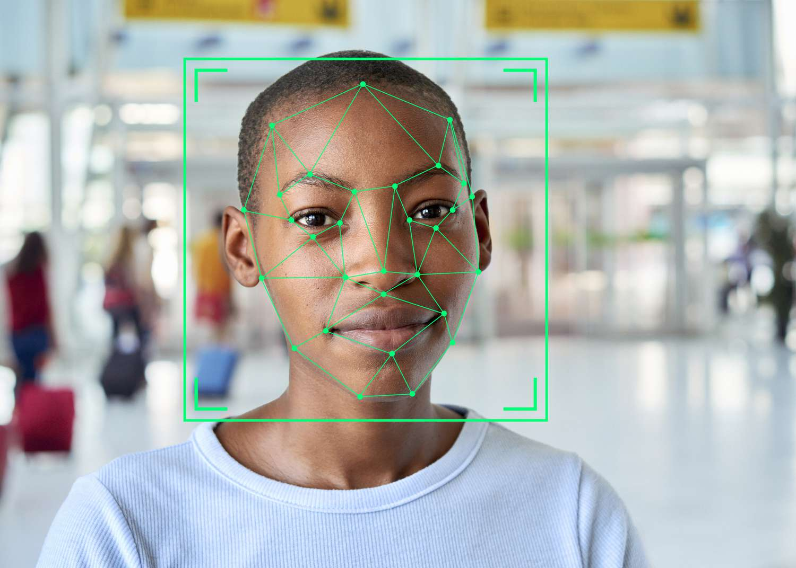
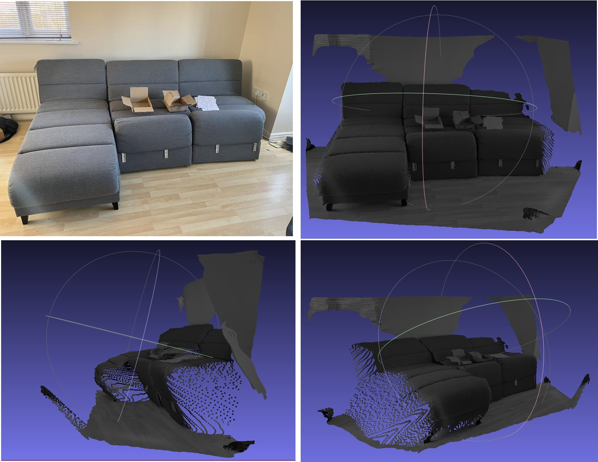
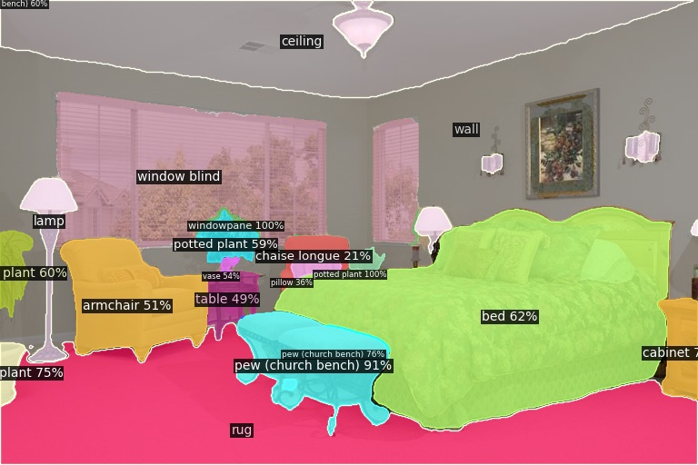
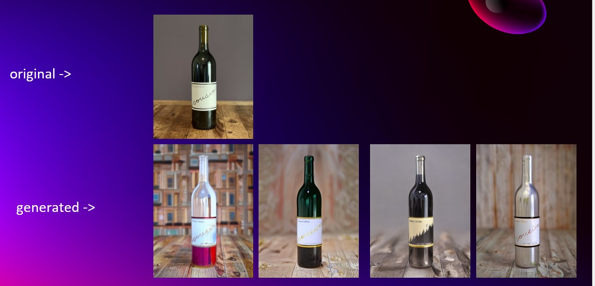

# TheiaEngine


TheiaEngine is a multi-modal Vision AI API that is built to perform most computer vision tasks from a single API call with the following fundamentals:
- `generalization` : give a general context of what is contained and happening in an image
- `communicable` : respond to questions and enquiries on specific details in an image
- `generate` : generate appealing images from prompts/descriptions and augment existing images
- `all-in-one` : single API with single endpoint able to deliver all functionality at once



# Getting Started ( Insider Testing )
TheiaEngine API is currently being going through beta testing. You can join the **beta testers** by following [this link](https://github.com/Gen-XR/TheiaEngine/discussions/2) to the TheiaEngine discussions and sign up for an API key and server URL.


- Ensure you have Python 3.7 or higher installed
- Install the TheiaEngine Python library
    ```
    pip install theiaengine
    ```
- Copy the API key you received for the beta testing and run any of the samples below.
- The maximum image resolution for uploads for now is `1500 x 1500 pixels`. This will be increased by general availability.
- [Scene description](#scene-description)
- [Scene QA](#scene-qa)
- [Human Analysis](#human-analysis)
- [OCR](#ocr)
- [Vehicle Detection](#vehicle-detection)
- [Object Detection](#object-detection)
- [All responses at once](#all-responses-at-once)
- [Coming soon](#coming-soon)


## Scene Description
By default, TheiaEngine returns a short description of a scene based on the content and context of the image. Below is a sample to retrieve description of an image.

**Curl / REST API**

```
curl -X POST "<server_URL>/upload?api_key=<api_key>" -F "files=@demo.jpg" -o response.json --max-time 600
cat response.json
```

```json
{
    "message": "successful", 
    "result": {
        "image_id": "92eddf4c-096e-40ca-b9ee-cd53e354562b",
        "transaction_id": "ae057d03-b091-42e1-8bae-df3b6ee5d447",
        "image_name": "demo.jpg", 
        "date_time": "2023-08-11 18:00:54.601445",
        "description": "a woman sitting on top of a car",
        "detections": [],
        "questions": [], 
        "ocr": []
    }
}
```

**Python Code:**

```python

from theiaengine import TheiaClient, TheiaPayload, TheiaResponseStatus

theia_client = TheiaClient(
    api_key="<api_key>",
    theia_url="<server_URL>"
)

payload = TheiaPayload()
payload.image = open(r"demo.jpg", "rb")

response = theia_client.inference(
    payload=payload
)

if response.status == TheiaResponseStatus.SUCCESS:
    result = response.result
    print(f"Image id: {result.image_id}")
    print(f"description: {result.description}")
else:
    print(f"{response.status}: {response.message}")
```

**Sample images:**



```
Image id: e23c8965-8f7d-4e32-8bd6-ab3c79cc46e7
description: a woman sitting on top of a car
```


```
Image id: 93dc2e9c-bcc2-4fb6-82fb-3ecd622a8d6e
description: a car show in a parking lot
```

## Scene QA
TheiaEngine allows you to obtain answers to multiple content and context questions of what is in an image.
See sample below.

**Curl / REST API**
```
curl -X POST "<server_URL>/upload?api_key=<api_key>&questions=what%20is%20the%20season%20of%20the%20image;%20is%20the%20lady%20in%20the%20image%20running%20or%20sitting;%20is%20the%20car%20in%20the%20image%20moving" -F "files=@demo.jpg" -o response.json --max-time 600
cat response.json
```
```json
{
    "message": "successful", 
    "result": {
        "image_id": "9e3430e5-1f7f-4141-b34c-e7a1698b19d7", 
        "transaction_id": "1f2271d2-aa9f-4699-96bc-141223916136", 
        "image_name": "demo.jpg", 
        "date_time": "2023-08-11 18:44:53.801750", 
        "description": "a woman sitting on top of a car", 
        "detections": [], 
        "questions": [
            {"what is the season of the image": "fall"}, 
            {" is the lady in the image running or sitting": "sitting"}, 
            {" is the car in the image moving": "no"}
        ], 
        "ocr": []
    }
}
```

**Python Code:**

```python
from theiaengine import TheiaClient, TheiaPayload, TheiaResponseStatus

theia_client = TheiaClient(
    api_key="<api_key>",
    theia_url="<server_URL>"
)

payload = TheiaPayload()
payload.image = open(r"demo.jpg", "rb")
payload.questions = [
    "what is the season of the image",
    "is the lady in the image running or sitting",
    "is the car in the image moving"
]

response = theia_client.inference(
    payload=payload
)

if response.status == TheiaResponseStatus.SUCCESS:
    result = response.result
    print(f"Image id: {result.image_id}")
    print(f"description: {result.description}")
    for q_result in result.questions:
        for question in q_result.keys():
            answer = q_result[question]
            print(f"{question} : {answer}")
else:
    print(f"{response.status}: {response.message}")
```


```
Image id: c66411ec-db64-45bb-a4fe-a7a2706eef5c
description: a car show in a parking lot
what is the season of the image : fall
is the lady in the image running or sitting : sitting
is the car in the image moving : no
```


For the sample below, we used the questions

```python
payload.questions = [
    "what is the man in red shirt doing",
    "is there a tent in the image",
    "is anyone holding an umbrella in the image"  
]
```


```
Image id: 62c55900-3aae-46e9-b059-752fce4e88fd
description: a car show in a parking lot
what is the man in red shirt doing : walking
is there a tent in the image : yes
is anyone holding an umbrella in the image : no
```


## Human Analysis
TheiaEngine can provide in depth analysis of each person in an image. For each person in the image, it returns the following
- name
- bbox ( xmin, ymin, xmax, ymax )
- analysis
  - gender
  - race
  - top_clothing
  - lower_clothing
  - footwear
  - extras

See sample below.

**Curl / REST API**
```
curl -X POST "<server_URL>/upload?api_key=<api_key>&return_human_analysis=True" -F "files=@demo.jpg" -o response.json --max-time 600
cat response.json
```
```json
{
    "message": "successful", 
    "result": {
        "image_id": "90d48ee4-c148-4fcc-bfd0-17ae42e9f20f", 
        "transaction_id": "a3cdf7d3-a2ff-4241-90b3-5923718dea3b", 
        "image_name": "demo.jpg", 
        "date_time": "2023-08-11 18:05:59.295328", 
        "description": "a woman sitting on top of a car", 
        "detections": [
            {
                "bbox": [298, 177, 470, 504], 
                "name": "person", 
                "analysis": {
                    "extras": [], 
                    "gender": "female", 
                    "race": "caucasian", 
                    "top_clothing": "leather", 
                    "lower_clothing": "skirt", 
                    "footwear": "nothing"
                }
            }
        ], 
        "questions": [], 
        "ocr": []}
}

```


**Python code**

```python
from theiaengine import TheiaClient, TheiaPayload, TheiaResponseStatus

theia_client = TheiaClient(
    api_key="<api_key>",
    theia_url="<server_URL>"
)

payload = TheiaPayload()
payload.image = open(r"demo.jpg", "rb")
payload.return_human_analysis = True

response = theia_client.inference(
    payload=payload
)

if response.status == TheiaResponseStatus.SUCCESS:
    result = response.result
    print(f"Image id: {result.image_id}")
    print(f"description: {result.description}")
    print(f"detections: {result.detections}")
else:
    print(f"{response.status}: {response.message}")
```

```
Image id: 6840f111-c378-4f6e-9fe1-d70ca8891e4e
description: a woman sitting on top of a car
detections: [{'bbox': [298, 177, 470, 504], 'name': 'person', 'analysis': {'extras': [], 'gender': 'female', 'race': 'caucasian', 'top_clothing': 'leather', 'lower_clothing': 'skirt', 'footwear': 'nothing'}}]
```


```
Image id: 38c74014-40a3-4c3d-9c01-2715315cf216
description: two men fighting in a parking lot
detections: [
    {'bbox': [302, 111, 380, 296], 'name': 'person', 'analysis': {'extras': ['fighting'], 'gender': 'male', 'race': 'white', 'top_clothing': 'no shirt', 'lower_clothing': 'shorts', 'footwear': 'tennis shoes'}}, 
    {'bbox': [387, 17, 449, 160], 'name': 'person', 'analysis': {'extras': ['fighting'], 'gender': 'female', 'race': 'white', 'top_clothing': 'tank top', 'lower_clothing': 'jeans', 'footwear': 'sandals'}}, 
    {'bbox': [195, 106, 342, 300], 'name': 'person', 'analysis': {'extras': ['fighting'], 'gender': 'male', 'race': 'black', 'top_clothing': 't shirt', 'lower_clothing': 'jeans', 'footwear': 'sneakers'}}
]
```

## OCR
TheiaEngine provides OCR and number plate recognition in images. For each text in the image, it returns the following
- text
- bbox ( xmin, ymin, xmax, ymax )

See sample below.

**Curl / REST API**
```
curl -X POST "<server_URL>/upload?api_key=<api_key>&return_ocr=True" -F "files=@car_park.jpg" -o response.json --max-time 600
cat response.json
```
```json
{
    "message": "successful", 
    "result": {
        "image_id": "6704d134-5863-4d96-b6cf-3ac7950c5c85", 
        "transaction_id": "e65190a2-b46b-4905-8ab2-e3e801cf0cfc", 
        "image_name": "car_park.jpg", 
        "date_time": "2023-08-11 18:51:26.048273", 
        "description": "a car show in a parking lot", 
        "detections": [], 
        "questions": [], 
        "ocr": [
            {"text": "BOOTHS", "bbox": [978, 320, 1084, 343]}, 
            {"text": "", "bbox": [738, 388, 772, 399]}, 
            {"text": "Lloydsphammaey", "bbox": [140, 418, 239, 446]}, 
            {"text": "Lloydshmsy", "bbox": [280, 430, 351, 455]}, 
            {"text": "C", "bbox": [153, 460, 169, 470]}, 
            {"text": "", "bbox": [179, 453, 226, 482]}, 
            {"text": "00", "bbox": [187, 475, 213, 487]}, 
            {"text": "YC52MRV", "bbox": [64, 555, 110, 570]}, 
            {"text": "SVO3SFJ", "bbox": [218, 601, 281, 622]}
        ]
    }
}
```

**Python Code**

```python

from theiaengine import TheiaClient, TheiaPayload, TheiaResponseStatus

theia_client = TheiaClient(
    api_key="<api_key>",
    theia_url="<server_URL>"
)

payload = TheiaPayload()
payload.image = open(r"car_park.jpg", "rb")
payload.return_ocr = True

response = theia_client.inference(
    payload=payload
)

if response.status == TheiaResponseStatus.SUCCESS:
    result = response.result
    print(f"Image id: {result.image_id}")
    print(f"ocr: {result.ocr}")
    for detection in result.ocr:
        print(f"ocr: {detection}")
else:
    print(f"{response.status}: {response.message}")

```


```
Image id: a873fef1-2cea-4a75-8588-3a86240badfb
ocr: [{'text': 'BOOTHS', 'bbox': [978, 320, 1084, 343]}, {'text': '', 'bbox': [738, 388, 772, 399]}, {'text': 'Lloydsphammaey', 'bbox': [140, 418, 239, 446]}, {'text': 'Lloydshmsy', 'bbox': [280, 430, 351, 455]}, {'text': 'C', 'bbox': [153, 460, 169, 470]}, {'text': '', 'bbox': [179, 453, 226, 482]}, {'text': '00', 'bbox': [187, 475, 213, 487]}, {'text': 'YC52MRV', 'bbox': [64, 555, 110, 570]}, {'text': 'SVO3SFJ', 'bbox': [218, 601, 281, 622]}]
ocr: {'text': 'BOOTHS', 'bbox': [978, 320, 1084, 343]}
ocr: {'text': '', 'bbox': [738, 388, 772, 399]}
ocr: {'text': 'Lloydsphammaey', 'bbox': [140, 418, 239, 446]}
ocr: {'text': 'Lloydshmsy', 'bbox': [280, 430, 351, 455]}
ocr: {'text': 'C', 'bbox': [153, 460, 169, 470]}
ocr: {'text': '', 'bbox': [179, 453, 226, 482]}
ocr: {'text': '00', 'bbox': [187, 475, 213, 487]}
ocr: {'text': 'YC52MRV', 'bbox': [64, 555, 110, 570]}
ocr: {'text': 'SVO3SFJ', 'bbox': [218, 601, 281, 622]}
```

## Vehicle Detection
TheiaEngine can detect and give bbox and analysis on the following types of vehicles
- `car`
- `suv`
- `motorcycle`
- `truck`
- `pickup truck`
- `machinery vehicle`
- `sports car`
- `tricycle`
- `fire truck`
- `heavy truck`
- `ambulance`
- `formula 1`
- `bus`
- `pickup truck`
- `tricycle`
- `crane`
- `heavy truck`

See sample below

**Curl / REST API**
```
curl -X POST "<server_URL>/upload?api_key=<api_key>&return_vehicles=True" -F "files=@vehicles.jpg" -o response.json --max-time 600
cat response.json
```
```json

{
    "message": "successful", 
    "result": {
        "image_id": "43151b91-b457-49bf-ad43-a02bd78c0f90", 
        "transaction_id": "91852bb7-86c8-4297-9e2e-55f4a30875f2", 
        "image_name": "vehicles.jpg", 
        "date_time": "2023-08-11 18:57:09.960619", 
        "description": "a fleet of trucks", 
        "detections": [
            {
                "bbox": [193, 155, 375, 303], 
                "name": "car", 
                "analysis": {"extras": [], "color": "red"}, "vehicle_plate": {"plate_number": "EE", "plate_bbox": [243, 223, 285, 233]}
            }, 
            {
                "bbox": [385, 143, 593, 304], 
                "name": "pickup truck", 
                "analysis": {"extras": [], "color": "white"}, 
                "vehicle_plate": {}
            }, 
            {
                "bbox": [493, 76, 800, 288], 
                "name": "truck", 
                "analysis": {"extras": [], "color": "white"}, 
                "vehicle_plate": {"plate_number": "snu", "plate_bbox": [735, 219, 758, 225]}
            }, 
            {
                "bbox": [0, 179, 205, 299], 
                "name": "car", 
                "analysis": {"extras": [], "color": "black"}, 
                "vehicle_plate": {}
            }
        ], 
        "questions": [], 
        "ocr": []
    }
}

```

**Python code**

```python
from theiaengine import TheiaClient, TheiaPayload, TheiaResponseStatus

theia_client = TheiaClient(
    api_key="<api_key>",
    theia_url="<server_URL>"
)

payload = TheiaPayload()
payload.image = open(r"vehicles.jpg", "rb")
payload.return_vehicles = True

response = theia_client.inference(
    payload=payload
)

if response.status == TheiaResponseStatus.SUCCESS:
    result = response.result
    print(f"Image id: {result.image_id}")
    print(f"description: {result.description}")
    print(f"detections: {result.detections}")
else:
    print(f"{response.status}: {response.message}")
```



```
Image id: 37889736-3db5-4a69-a3e9-1b6940a8fa7b
description: a fleet of trucks
detections: [
    {'bbox': [193, 155, 375, 303], 'name': 'car', 'analysis': {'extras': [], 'color': 'red'}, 'vehicle_plate': {'plate_number': 'EE', 'plate_bbox': [243, 223, 285, 233]}}, 
    {'bbox': [385, 143, 593, 304], 'name': 'pickup truck', 'analysis': {'extras': [], 'color': 'white'}, 'vehicle_plate': {}}, 
    {'bbox': [493, 76, 800, 288], 'name': 'truck', 'analysis': {'extras': [], 'color': 'white'}, 'vehicle_plate': {'plate_number': 'snu', 'plate_bbox': [735, 219, 758, 225]}}, 
    {'bbox': [0, 179, 205, 299], 'name': 'car', 'analysis': {'extras': [], 'color': 'black'}, 'vehicle_plate': {}}
]
```

## Object Detection
TheiaEngine supports standard object detection and can detect 300+ objects. For a full list of objects it can detect, see the [detection_classes.txt](extras/detection_classes.txt) file.

See sample below.

**Curl / REST API**

```
curl -X POST "<server_URL>/upload?api_key=<api_key>&return_objects=True" -F "files=@living_room.webp" -o response.json --max-time 600
cat response.json
```

```json
{
    "message": "successful", 
    "result": {
        "image_id": "23d66ff2-4ed9-4528-896e-cd472430ac10", 
        "transaction_id": "03aa9dfa-83dd-49be-accc-07a2a3c476d9", 
        "image_name": "living_room.webp", 
        "date_time": "2023-08-11 19:42:42.591462", 
        "description": "a living room with a green couch and colorful pillows", 
        "detections": [
            {"bbox": [695, 426, 877, 518], "name": "pillow", "analysis": {"extras": [], "color": "orange"}}, 
            {"bbox": [1023, 425, 1176, 567], "name": "pillow", "analysis": {"extras": [], "color": "brown"}}, 
            {"bbox": [1212, 497, 1225, 566], "name": "candle", "analysis": {"extras": [], "color": "white"}}, 
            {"bbox": [430, 1, 791, 171], "name": "cabinet/shelf", "analysis": {"extras": [], "color": "white"}}, 
            {"bbox": [456, 130, 516, 159], "name": "book", "analysis": {"extras": [], "color": "red and yellow"}}, 
            {"bbox": [632, 349, 688, 387], "name": "book", "analysis": {"extras": [], "color": "black"}}, 
            {"bbox": [368, 531, 689, 713], "name": "stool", "analysis": {"extras": [], "color": "green"}}, 
            {"bbox": [553, 25, 589, 70], "name": "vase", "analysis": {"extras": [], "color": "white"}}, 
            {"bbox": [701, 256, 766, 335], "name": "person", "analysis": {"extras": [], "gender": "female"}}, 
            {"bbox": [844, 522, 942, 606], "name": "book", "analysis": {"extras": [], "color": "yellow"}}, 
            {"bbox": [934, 563, 1058, 607], "name": "book", "analysis": {"extras": [], "color": "white"}}, 
            {"bbox": [1022, 430, 1146, 597], "name": "flower", "analysis": {"extras": [], "color": "yellow"}}, 
            {"bbox": [692, 346, 771, 385], "name": "book", "analysis": {"extras": [], "color": "black"}}, 
            {"bbox": [348, 75, 444, 254], "name": "cabinet/shelf", "analysis": {"extras": [], "color": "white"}}, 
            {"bbox": [363, 336, 411, 386], "name": "vase", "analysis": {"extras": [], "color": "green"}}, 
            {"bbox": [349, 415, 1335, 706], "name": "couch", "analysis": {"extras": [], "color": "green"}}, 
            {"bbox": [1146, 573, 1243, 603], "name": "book", "analysis": {"extras": [], "color": "white"}}, 
            {"bbox": [258, 269, 369, 598], "name": "lamp", "analysis": {"extras": [], "color": "white"}}, 
            {"bbox": [95, 622, 429, 786], "name": "stool", "analysis": {"extras": [], "color": "green"}}, 
            {"bbox": [1074, 418, 1197, 524], "name": "pillow", "analysis": {"extras": [], "color": "brown"}}, 
            {"bbox": [707, 94, 782, 159], "name": "book", "analysis": {"extras": [], "color": "white"}}, 
            {"bbox": [422, 484, 631, 546], "name": "pillow", "analysis": {"extras": [], "color": "white"}}, 
            {"bbox": [431, 387, 612, 499], "name": "pillow", "analysis": {"extras": [], "color": "brown"}}, 
            {"bbox": [1165, 454, 1353, 522], "name": "pillow", "analysis": {"extras": [], "color": "white"}}, 
            {"bbox": [692, 240, 774, 348], "name": "picture/frame", "analysis": {"extras": [], "color": "black and white"}}, 
            {"bbox": [572, 190, 635, 251], "name": "picture/frame", "analysis": {"extras": [], "color": "black"}}, 
            {"bbox": [11, 479, 174, 600], "name": "pillow", "analysis": {"extras": [], "color": "red"}}, 
            {"bbox": [783, 312, 849, 387], "name": "lamp", "analysis": {"extras": [], "color": "white"}}, 
            {"bbox": [574, 420, 726, 523], "name": "pillow", "analysis": {"extras": [], "color": "yellow"}}, 
            {"bbox": [476, 183, 559, 289], "name": "picture/frame", "analysis": {"extras": [], "color": "black"}}, 
            {"bbox": [864, 383, 1047, 526], "name": "pillow", "analysis": {"extras": [], "color": "pink"}}, 
            {"bbox": [996, 0, 1152, 248], "name": "lamp", "analysis": {"extras": [], "color": "white"}}], "questions": [], "ocr": []
    }
}
```

**Python code**

```python
from theiaengine import TheiaClient, TheiaPayload, TheiaResponseStatus

theia_client = TheiaClient(
    api_key="<api_key>",
    theia_url="<server_URL>"
)

payload = TheiaPayload()
payload.image = open(r"living_room.webp", "rb")
payload.return_objects = True

response = theia_client.inference(
    payload=payload
)

if response.status == TheiaResponseStatus.SUCCESS:
    result = response.result
    print(f"Image id: {result.image_id}")
    print(f"description: {result.description}")
    print(f"detections: {result.detections}")
else:
    print(f"{response.status}: {response.message}")
```




```
Image id: 4873feb0-8fae-4b83-8089-946f81729b3d
description: a living room
detections: [
    {'bbox': [487, 7, 531, 66], 'name': 'book', 'analysis': {'extras': [], 'color': 'blue'}},
    {'bbox': [464, 58, 526, 75], 'name': 'book', 'analysis': {'extras': [], 'color': 'black'}},
    {'bbox': [1212, 497, 1225, 565], 'name': 'candle', 'analysis': {'extras': [], 'color': 'white'}},
    {'bbox': [1021, 426, 1156, 562], 'name': 'pillow', 'analysis': {'extras': [], 'color': 'brown'}},
    {'bbox': [368, 531, 689, 713], 'name': 'stool', 'analysis': {'extras': [], 'color': 'green'}},
    {'bbox': [1022, 429, 1145, 591], 'name': 'flower', 'analysis': {'extras': [], 'color': 'yellow'}},
    {'bbox': [456, 130, 515, 159], 'name': 'book', 'analysis': {'extras': [], 'color': 'yellow'}},
    {'bbox': [554, 26, 590, 70], 'name': 'vase', 'analysis': {'extras': [], 'color': 'white'}},
    {'bbox': [698, 253, 767, 338], 'name': 'person', 'analysis': {'extras': [], 'gender': 'female'}},
    {'bbox': [631, 344, 689, 388], 'name': 'book', 'analysis': {'extras': [], 'color': 'white'}},
    {'bbox': [844, 522, 946, 606], 'name': 'book', 'analysis': {'extras': [], 'color': 'yellow'}},
    {'bbox': [441, 1, 793, 166], 'name': 'cabinet/shelf', 'analysis': {'extras': [], 'color': 'white'}},
    {'bbox': [934, 563, 1059, 607], 'name': 'book', 'analysis': {'extras': [], 'color': 'green'}},
    {'bbox': [363, 336, 411, 386], 'name': 'vase', 'analysis': {'extras': [], 'color': 'green'}},
    {'bbox': [270, 178, 354, 249], 'name': 'book', 'analysis': {'extras': [], 'color': 'black'}},
    {'bbox': [695, 345, 772, 384], 'name': 'book', 'analysis': {'extras': [], 'color': 'black'}},
    {'bbox': [348, 74, 444, 254], 'name': 'cabinet/shelf', 'analysis': {'extras': [], 'color': 'white'}},
    {'bbox': [1146, 573, 1243, 603], 'name': 'book', 'analysis': {'extras': [], 'color': 'black'}},
    {'bbox': [353, 416, 1324, 707], 'name': 'couch', 'analysis': {'extras': [], 'color': 'green'}},
    {'bbox': [258, 268, 368, 598], 'name': 'lamp', 'analysis': {'extras': [], 'color': 'white'}},
    {'bbox': [1074, 418, 1196, 525], 'name': 'pillow', 'analysis': {'extras': [], 'color': 'brown'}},
    {'bbox': [94, 624, 429, 786], 'name': 'stool', 'analysis': {'extras': [], 'color': 'green'}},
    {'bbox': [707, 94, 780, 159], 'name': 'book', 'analysis': {'extras': [], 'color': 'white'}},
    {'bbox': [422, 484, 630, 546], 'name': 'pillow', 'analysis': {'extras': [], 'color': 'pink'}},
    {'bbox': [431, 387, 613, 499], 'name': 'pillow', 'analysis': {'extras': [], 'color': 'brown'}},
    {'bbox': [1164, 454, 1353, 522], 'name': 'pillow', 'analysis': {'extras': [], 'color': 'white'}},
    {'bbox': [692, 240, 774, 348], 'name': 'picture/frame', 'analysis': {'extras': [], 'color': 'black and white'}},
    {'bbox': [572, 189, 636, 251], 'name': 'picture/frame', 'analysis': {'extras': [], 'color': 'white'}},
    {'bbox': [11, 479, 175, 601], 'name': 'pillow', 'analysis': {'extras': [], 'color': 'red'}},
    {'bbox': [786, 311, 850, 387], 'name': 'lamp', 'analysis': {'extras': [], 'color': 'white'}},
    {'bbox': [574, 419, 727, 524], 'name': 'pillow', 'analysis': {'extras': [], 'color': 'gold'}},
    {'bbox': [863, 384, 1046, 526], 'name': 'pillow', 'analysis': {'extras': [], 'color': 'pink'}},
    {'bbox': [475, 183, 559, 289], 'name': 'picture/frame', 'analysis': {'extras': [], 'color': 'black'}},
    {'bbox': [996, 0, 1152, 249], 'name': 'lamp', 'analysis': {'extras': [], 'color': 'white'}}
 ]
```

## All responses at once.
You can retrieve all possible results from TheiaEnine by setting all available returns to true.

**CAUTION**: It is advised that you specify only the returns you need from the API and not default to returning all responses everytime. This is because returning multiple or all possible responses at once slows the server down and can increase response time.

See sample code below

**Curl / REST API**

```
curl -X POST "<server_URL>/upload?api_key=<api_key>&questions=what%20is%20the%20season%20of%20the%20image;%20is%20the%20lady%20in%20the%20image%20running%20or%20sitting;%20is%20the%20car%20in%20the%20image%20moving&return_objects=True&return_human_analysis=True&return_ocr=True&return_vehicles=True" -F "files=@car_park.jpg" -o response.json --max-time 600
cat response.json
```

**Python Code**

```python
from theiaengine import TheiaClient, TheiaPayload, TheiaResponseStatus

theia_client = TheiaClient(
    api_key="<api_key>",
    theia_url="<server_URL>"
)

payload = TheiaPayload()
payload.image = open(r"car_park.jpg", "rb")
payload.return_objects = True
payload.return_human_analysis = True
payload.return_ocr = True
payload.return_vehicles = True
payload.questions = [
    "what is the man in red shirt doing",
    "is there a tent in the image",
    "is anyone holding an umbrella in the image"  
]

response = theia_client.inference(
    payload=payload
)

if response.status == TheiaResponseStatus.SUCCESS:
    result = response.result
    print(f"Image id: {result.image_id}")
    print(f"description: {result.description}")
    print(f"detections: {result.detections}")
    print(f"ocr: {result.ocr}")
    print(f"questions: {result.questions}")
else:
    print(f"{response.status}: {response.message}")
```

## Coming Soon
The following features will be added soon to the API
- Face recognition
  - 
- 2D-to-3D point cloud generation
  - 
- Scene mapping 
  - 
- Image Embedding/Search
- Image Generation/Augmentation
  - 